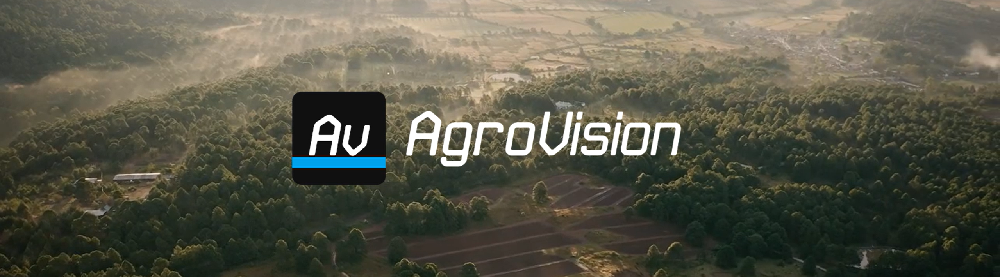

#### Características

- 💻 C#, .Net Framework
- 🌎 Visualizador de Mapas do Google
- ☀️ API de clima (AccuWeather)
- 🤖 API para gerenciar missões de drones DJI
- 📷 API para manipular imagens de câmeras multispectrais (Como a MAPIR Survey3)
- 📱 API do ADB para transferência das missões no [AgroVision Cabin](https://github.com/Rafa-Matheus/AgroVisionCabin)
- 🔢 Algoritmos para cálculo da geolocalização

#### Descrição do Projeto

O AgroVision é um sistema comoposto por software e app para a execução
das missões ([AgroVision Cabin](https://github.com/Rafa-Matheus/AgroVisionCabin)), que possibilita gerar planos de vôos autônomos para drones DJI das famílias
Phantom e Mavic, com a finalidade de obter imagens de áreas de plantio a partir de
câmeras multiespectrais, e em seguida fazer o processamento das mesmas.

Através do software é possível executar o processamento das imagens, e com
o recurso diferenciado da calculadora raster, aplicar sobre elas quaisquer dos índices
mais usados na agricultura, como o NDVI, EVI, GNDVI, LAI, NDRE e etc. Pelo espectro
obtido no processamento e de acordo com o cálculo aplicado, é possível determinar o
percentual de plantação mapeada que está saudável, e também os percentuais que
representam perda de produção no curto prazo, caso não seja aplicado um manejo
específico. Após as rotinas de manejo, o ideal é fazer novos mapeamentos para
acompanhar as alterações espectrais que dirão se o produtor conseguiu recuperar sua
produção ou não, e isso automaticamente gera uma métrica de qualidade do manejo,
isto é, se o mesmo está sendo adequado ou não. Ao ato de fazer mapeamentos
periódicos com a finalidade explicada anteriormente, denominamos de monitoramento
espectro-temporal.

#### Demonstração

Veja a demonstração no site:
https://sforzatec.com.br/#servicos